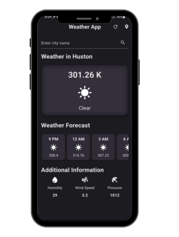

# Weather App

### Overview
The Weather App is a Flutter-based mobile application that provides users with real-time weather updates for their current location or any specified city. It uses the OpenWeatherMap API to fetch weather data and displays it in a user-friendly interface.

### Features
-**Real-Time Weather Updates:** Get the latest weather information for your current location.
-**Search by City:** Enter a city name to get weather updates for any location worldwide.
-**Location-Based Weather:** Automatically fetch weather data based on the device's location.
-**Hourly Forecast:** View the 24-hour weather forecast for the selected location.
-**Additional Information:** Get detailed information such as temperature, humidity, pressure, and wind speed.
### UI

